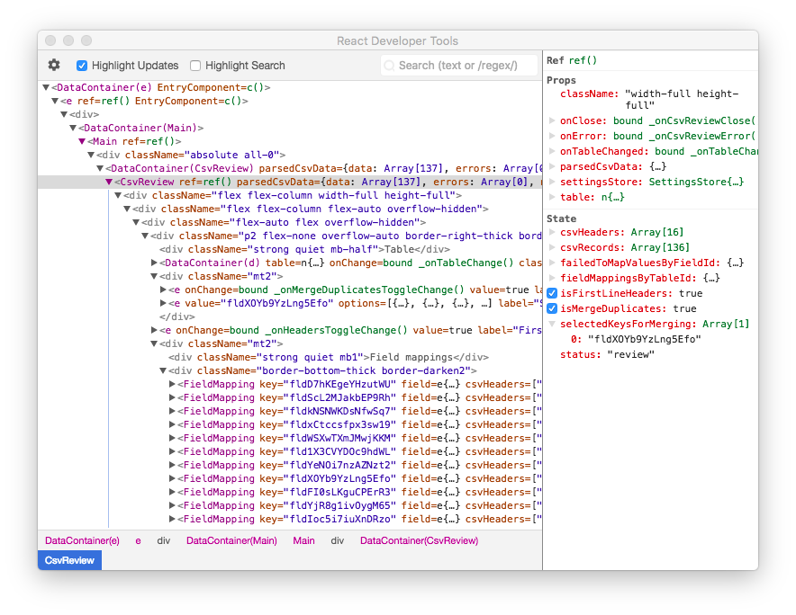

# @airtable/blocks

For guides, check out the tutorials on Quip.

## Blocks development best practices

There are a few best practices that we've found make block developing easier. That said, nothing is
set in stone, so let us know if you have any ideas for improvements!

### Global config

-   You should use the synced pickers (which read and write to globalConfig automatically, and
    handle permissions) wherever possible, and only using the regular pickers where necessary. To
    make a custom synced component, use `UI.Synced`.

-   Wrapping your block-specific configuration in a singleton class can help get rid of some of the
    boilerplate code (for setting default values and validating the block configuration) that is
    needed when dealing with globalConfig. An example of a potential `SettingsStore` singleton:

```js
import {base, globalConfig, UI} from 'airtable-block';

const SCHEMA_VERSION = 1;

const ConfigKeys = {
    // By convention: it's a good idea to store a schemaVersion
    // integer in globalConfig and watch its value from the root
    // component. If its value changes to be > SCHEMA_VERSION,
    // prompt the user to reload the block using UI.globalAlert.showReloadPrompt()
    // This will make it easy to make breaking changes in the future.
    schemaVersion: 'schemaVersion',
    tableId: 'tableId',
};

class SettingsStore {
    constructor() {
        if (
            // Make sure the user can write to globalConfig (read/comment-only
            // users can't update globalConfig)
            globalConfig.canSet(ConfigKeys.schemaVersion) &&
            globalConfig.get(ConfigKeys.schemaVersion) === undefined
        ) {
            globalConfig.set(ConfigKeys.schemaVersion, SCHEMA_VERSION);
        }
    }
    // This function should contain all of the checks to determine whether the
    // block is fully configured. This way, you can simply call this method to
    // determine if config is valid, and display the appropriate message if it
    // is not.
    validate() {
        if (!this.table) {
            return {isValid: false, message: 'Pick a table'};
        }
        return {isValid: true};
    }
    get table() {
        // getters can decide what the default value should be
        // if the config value is not set, and translate model IDs
        // into model instances.
        const tableId = globalConfig.get(ConfigKeys.tableId);
        return tableId ? base.getTableById(tableId) : null;
    }
    set table(newTable) {
        // setters translate models back to model IDs.
        const tableId = newTable ? newTable.id : null;
        globalConfig.set(ConfigKeys.tableId, tableId);
    }
    // This is useful, since all of the watches that can affect config values
    // are scoped to this one place.
    // E.g. if you store a table and a field in global config, you wouldn't need
    // to remember to watch the tables in case a field's parent table is deleted.
    get watches() {
        // Example watches
        return [
            // Watch all the relevant globalConfig keys.
            {watch: globalConfig, key: Object.keys(ConfigKeys)},
            {watch: base, key: 'permissionLevel'},
            // Watch for table deletion.
            {watch: base, key: 'tables'},
            // Watch for field deletion.
            {watch: this.table, key: 'fields'},
        ];
    }
    isSchemaVersionOutOfDate() {
        return globalConfig.get(ConfigKeys.schemaVersion) > SCHEMA_VERSION;
    }
}

// Settings store usage
const settingsStore = new SettingsStore();

class RootComponent extends React.Component {
    componentDidMount() {
        this._showReloadPromptIfNeeded();
    }
    _showReloadPromptIfNeeded() {
        if (settingsStore.isSchemaVersionOutOfDate) {
            UI.globalAlert.showReloadPrompt();
        }
    }
    render() {
        const {table} = settingsStore;
        if (table) {
            return <div>{table.name}</div>;
        } else {
            return <div>No table</div>;
        }
    }
}

export default UI.createDataContainer(RootComponent, props => [
    ...settingsStore.watches,
    {
        watch: globalConfig,
        key: ConfigKeys.schemaVersion,
        callback: RootComponent.prototype._showReloadPromptIfNeeded,
    },
]);
```

### Local storage

-   Instead of using `window.localStorage` or `window.sessionStorage`, use `localStorage` and
    `sessionStorage` from `airtable-block`. Those have the same API as the native storage options,
    but will seamlessly fall back to in-memory storage when native localStorage/sessionStorage
    aren't available due to privacy settings (e.g. when Chrome's “Block third-party cookies” option
    is turned on). The native APIs will throw in that scenario.

```js
import {localStorage, sessionStorage} from 'airtable-block';
```

## Field types and cell values

Each field in a table has a type and associated configuration. You can inspect this information by
looking at `field.type` & `field.options`. For example, a date field's `type` & `options` looks like
this:

```js
myField.type;
// => "date"

myField.options;
// => {
//     "dateFormat": {
//         "name": "us",
//         "format": "M/D/YYYY"
//     }
// }
```

The cell values depend on the type of the field. You can use the "Inspector" block to look at the
raw cell values in a table.

The list of field types is:

```js
import {models} from 'airtable-block';
models.fieldTypes = {
    SINGLE_LINE_TEXT: 'singleLineText',
    EMAIL: 'email',
    URL: 'url',
    MULTILINE_TEXT: 'multilineText',
    NUMBER: 'number',
    CURRENCY: 'currency',
    PERCENT: 'percent',
    SINGLE_SELECT: 'singleSelect',
    MULTIPLE_SELECTS: 'multipleSelects',
    SINGLE_COLLABORATOR: 'singleCollaborator',
    MULTIPLE_COLLABORATORS: 'multipleCollaborators',
    MULTIPLE_RECORD_LINKS: 'multipleRecordLinks',
    DATE: 'date',
    DATE_TIME: 'dateTime',
    PHONE_NUMBER: 'phoneNumber',
    MULTIPLE_ATTACHMENTS: 'multipleAttachments',
    CHECKBOX: 'checkbox',
    FORMULA: 'formula',
    CREATED_TIME: 'createdTime',
    ROLLUP: 'rollup',
    COUNT: 'count',
    LOOKUP: 'lookup',
    AUTO_NUMBER: 'autoNumber',
    BARCODE: 'barcode',
    RATING: 'rating',
    RICH_TEXT: 'richText',
    DURATION: 'duration',
};
```

Rollups, formulas, and lookups are computed fields, which means they can't be updated manually and
their cell format is ultimately based on some other non-computed field. For these computed fields,
you can inspect `field.options.resultConfig` to see what the underlying format is. The
`resultConfig` will be equivalent to `{type: field.type, options: field.options}` of the underlying
field type. For example, a rollup's `resultConfig` can be `{type: 'date', ...}` or
`{type: 'dateTime', ...}`.

There are currently some rough edges to be aware of:

-   `CREATED_TIME` is a computed field, so it also has `resultConfig` right now. We'll probably
    change created time's config to look more like the config of `DATE` and `DATE_TIME` fields so
    the options don't nest under resultConfig.
-   Lookup cell values are arrays. For example, a lookup of a text field will have
    `field.options.resultConfig === {type: 'singleLineText'}` but each cell value will actually be
    an array of strings.
-   Before inspecting the `resultConfig` of computed fields, you should first check
    `field.options.isError`. If `isError` is true, there won't be a `resultConfig` (usually as a
    result of an error in the formula, or if one of the fields the computed field depends on has
    been deleted).

## Blocks testing checklist

When building and testing a block, here are some common things to test:

### Permissions

-   Does the block correctly handle the different user permission levels? You can simulate this in
    development mode.
    -   In read-only mode the block should not attempt to mutate any records or globalConfig. You
        can check before performing actions by using:
        -   globalConfig.canSet, globalConfig.canSetPaths
        -   record.canSetCellValue, record.canSetCellValues, record.canDelete
        -   table.canSetCellValues, table.canCreateRecord, table.canCreateRecords,
            table.canDeleteRecord, table.canDeleteRecords
-   Note that the user's permission level may change in real-time! Your components should watch
    base.permissionLevel to re-render appropriately (e.g. to disable any relevant inputs or buttons)
-   The Synced components will automatically disable themselves for read-only users.

### Model mutation

-   Does the block correctly handle the deletion of any models (e.g. table, view, field, record) it
    depends on? Two cases to test:
    -   the model is deleted while the block is running (block needs to handle the deletion in
        real-time)
    -   the model is deleted while the block is not running (block needs to handle the deletion next
        time it runs). To test this, stop running the block (or disable it), delete the model, then
        run the block again.
-   Note that the type of a field can change. E.g. a text field may turn into a formula field, in
    which case trying to write to it will fail. Or a text field may turn into a number field, in
    which case writing a string to it will throw an error.
-   Note that model deletions/updates can come from the current client or remote collaborators. You
    generally shouldn't need to do anything special to handle the two different cases as long as
    you're watching the right things.

### Viewport sizes

-   As much as reasonably possible, blocks should be responsive to different viewport sizes.
-   On the smaller end, use viewport.setMinSize to set the breakpoint below which we'll show a
    “Please make this block bigger” message.
-   For certain blocks, it may make sense to use viewport.setMaxFullscreenSize to constrain the
    maximum height or width of the block when it is fullscreen. This does not affect the block when
    it's not fullscreen. This is useful for dialog-type blocks (e.g. batch update), but should not
    be used to overly constrain visualization-type blocks (e.g. map, timeline)

### Onboarding

-   When a block is running for the first time, try to automatically configure as many options as
    possible. Usually this default setup is performed in the SettingsStore constructor. For example
    (adapted from the Chart block):

```js
// Note that permission check! If we don't do this and
// the block starts running without a table for a user
// with read-only permissions, it'll crash.
//
// Also note the isFirstRun check. If we don't do this,
// the block will unexpectedly choose a new table if the
// table it was previously using is deleted and the block reloads.
import {runInfo} from 'airtable-block';
if (globalConfig.canSet(ConfigKeys.tableId) && runInfo.isFirstRun && !this.table) {
    // Make the block use the table the user is currently looking at (base.activeTable).
    // base.activeTable may be null if the user is in between switching tables, in which
    // case just fallback to the first table in the base.
    const table = base.activeTable || base.tables[0];
    this.table = table;

    // getDefaultViewOfType will return the active view if there is one and it
    // satisfies allowedViewTypes. Otherwise, it will return the first view that
    // satisfied allowedViewTypes, if any. Note that every table has at least 1
    // grid view.
    this.view = table.getDefaultViewOfType(allowedViewTypes);

    // Depending on the block, you may be able to choose
    // some other sensible defaults. For example, the chart
    // will attempt to show a bar chart using the first single
    // select or single collaborator field it finds.
    for (const field of table.fields) {
        if (
            field.type === models.fieldTypes.SINGLE_SELECT ||
            field.type === models.fieldTypes.SINGLE_COLLABORATOR
        ) {
            this.xField = field;
            break;
        }
    }
}
```

-   You can simulate this scenario by running with empty globalConfig and different permission
    levels.

### Browser compatibility

-   Officially, these are browsers that Airtable supports:
    https://support.airtable.com/hc/en-us/articles/217990018-What-are-the-technical-requirements-for-using-Airtable-
    -   If supporting these requirements in the block you're building is too onerous, we can
        reconsider the requirements.
-   Note that we currently only include regenerator-runtime instead of the full babel polyfill,
    which can lead to issues in slightly older browsers (e.g. Object.values in older Chrome). We'll
    probably serve a more robust polyfill in the future.

## flow

Supported flow version: 0.98.1.

The `stubs` folder contains empty stub files so you can run Flow in this directory without it
complaining.

### Setting up flow for a block

Install flow and the SDK repo:

```sh
yarn add --dev flow-bin@0.98.1
```

Create a `.flowconfig` file in your repo and add the following:

```
[ignore]

[include]

[libs]
./node_modules/blocks-sdk/flow-typed/

[lints]

[options]
suppress_comment= \\(.\\|\n\\)*flow-disable-next-line
module.name_mapper='^frontend\/\(.*\)$' -> '<PROJECT_ROOT>/frontend/\1'
module.name_mapper='^shared\/\(.*\)$' -> '<PROJECT_ROOT>/shared/\1'
module.name_mapper='^airtable-block$' -> '<PROJECT_ROOT>/node_modules/blocks-sdk/flow-index.js'
module.name_mapper='^airtable-block\/\(.*\)$' -> '<PROJECT_ROOT>/node_modules/blocks-sdk/src/shared/\1'
module.name_mapper='^block_sdk\/\(.*\)$' -> '<PROJECT_ROOT>/node_modules/blocks-sdk/src/\1'
module.name_mapper='^client\/\(.*\)$' -> '<PROJECT_ROOT>/node_modules/blocks-sdk/src/stubs/client/\1'
module.name_mapper='^client_server_shared\/\(.*\)$' -> '<PROJECT_ROOT>/node_modules/blocks-sdk/src/stubs/client_server_shared/\1'
```

Add a flow script to package.json:

```json
  "scripts": {
    "flow": "flow"
  }
```

Run flow:

```sh
npm run flow
```

## Using React Devtools with Blocks

Since blocks run in an `<iframe>` it is not possible to use React Devtools as a browser extension.
However, it is possible to use the
[standalone version of react-devtools](https://github.com/facebook/react-devtools/tree/master/packages/react-devtools)
with some help from [Tampermonkey](https://tampermonkey.net/).

### Installation

-   Install `react-devtools`: `npm install -g react-devtools`
-   Install Tampermonkey as an extension to your browser.
-   Add this userscript to Tampermonkey:

```js
// ==UserScript==
// @name         Add ReactDev tools script tag
// @namespace    https://airtable.com/
// @version      0.1
// @description  Enables standalone ReactDevTools by inserting a script before the Block bundle
// @author       Manuel Aristaran
// @match        *://*.airtableblocks.com/__runFrame
// @match        *://*.airtableblocks.com/__runFrame?*
// @run-at       document-start
// @grant        none
// ==/UserScript==

(function() {
    'use strict';

    var scr = document.createElement('script');
    scr.type = 'text/javascript';
    scr.src = 'http://localhost:8097';
    document.head.prepend(scr);
})();
```

### Usage

-   Run `react-devtools`
-   Open a base that contains a block
-   You should see something like this in `react-devtools`:


