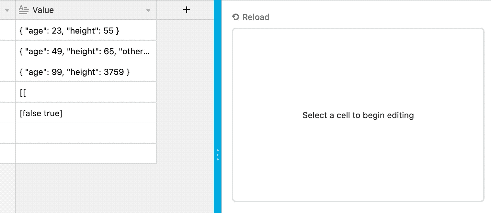

# JSON editor block

When the user selects a cell with a text field type in grid view, this block displays a text editor
allowing them to modify the cell value and alerts them of syntax errors.

The code shows:

-   How to use the Cursor API to detect when a user has selected a record in grid view and how to
    get the selected record.
-   How to dynamically load a third-party JavaScript library like
    [Monaco](https://github.com/Microsoft/monaco-editor).

## See the block running

