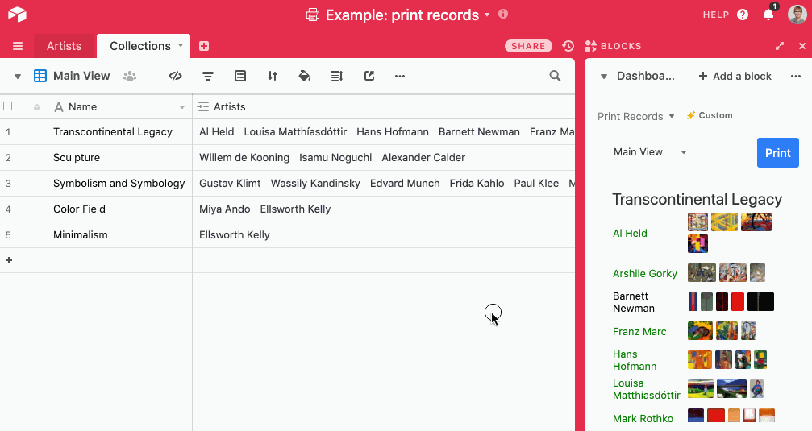

# Print records app

This example app shows artists and their artworks, grouped by collection.

The code shows how to create a printable record layout. It features:

-   Many records shown on the same page.

-   Records printed alongside their linked records.

-   Content areas that resize dynamically to the amount of content in a field.

-   A button to print the layout.

-   The use of `CellRenderer` to display rich base content with very little code.

-   Styling that changes, based on the base content.

## How to run this app

1. Create a new base using the
   [Art Gallery Management template](https://airtable.com/templates/creative/expAZgezgpfCF8wVH/art-gallery-management).

2. Create a new app in your new base (see
   [Create a new app](https://airtable.com/developers/blocks/guides/hello-world-tutorial#create-a-new-app)),
   selecting "Print records" as your template.

3. From the root of your new app, run `block run`.

## See the app running

