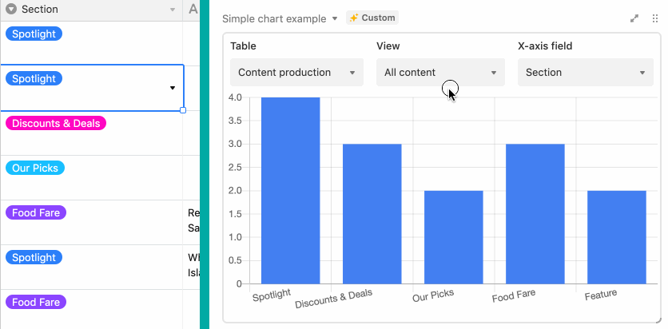

# Simple chart app

This example app shows a bar chart of data from a table.

The code shows:

-   How to use the Chart.js external library.

-   How to store app-related data using `globalConfig` and `Synced` UI components.

## How to run this app

1. Create a new base using the
   [Sales CRM template](https://airtable.com/templates/sales-and-customers/expvjTzYAZareV1pt/sales-crm).

2. Create a new app in your new base (see
   [Create a new app](https://airtable.com/developers/blocks/guides/hello-world-tutorial#create-a-new-app)),
   selecting "Simple chart" as your template.

3. From the root of your new app, run `block run`.

## See the app running

