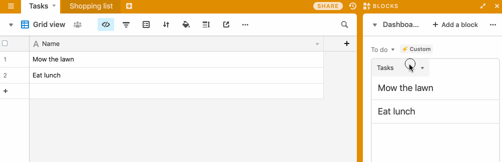

# To-do list Block

This example block shows a to-do list based on the records in a table.

The code shows:

-   How to query and display data from your base.

-   How to use core Airtable functions like "expand record".

-   How to use the built-in component library to let the user choose a table.

-   How to store settings in `globalConfig`.

## How to run this block

1. Copy
   [this base](https://airtable.com/shrKs6a2cQPEK5yzr/tbl1O3LqNL0wSBjfw/viwiJOsjivcJFXAAB?blocks=hide).

2. Create a new block in your new base (see the [setup guide](/packages/sdk/docs/setup.md)), pasting
   the template block token `@airtable/todo-block` into the `template` field.

3. From the root of your new block, run `block run`.

## Template block token

The token for using this code as a starting point for a new block. (See above for further
instructions on how to do this.)

```
@airtable/todo-block
```

## See the block running


