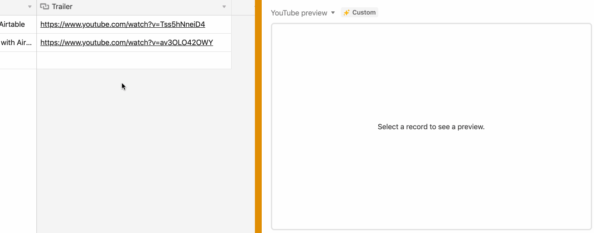

# URL preview block

When the user selects a record in grid view, this block gets a preview URL from the record and shows
the corresponding preview. This block supports previews from the following services: YouTube, Vimeo,
Spotify, Soundcloud, and Figma.

The code shows:

-   How to use the Cursor API to detect when a user has selected a record in grid view, and how to
    get the selected record.

-   How to embed content in a block.

## How to run this block

1. Copy [this base](https://airtable.com/shrg3CySSks0nRw5w).

2. Create a new block in your new base (see
   [Create a new block](https://airtable.com/developers/blocks/guides/hello-world-tutorial#create-a-new-block),
   selecting "URL preview" as your template.

3. From the root of your new block, run `block run`.

## See the block running

