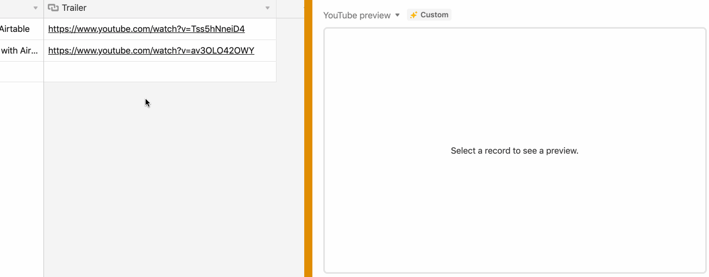

# URL preview extension

When the user selects a record in grid view, this extension gets a preview URL from the record and
shows the corresponding preview. This extension supports previews from the following services:
YouTube, Vimeo, Spotify, Soundcloud, and Figma.

The code shows:

-   How to use the Cursor API to detect when a user has selected a record in grid view, and how to
    get the selected record.

-   How to embed content in an extension.

## How to run this extension

1. Create a new base (or you can use an existing base).

2. Create a new extension in your new base (see
   [Create a new extension](https://airtable.com/developers/blocks/guides/hello-world-tutorial#create-a-new-app)),
   selecting "URL preview" as your template.

3. From the root of your new extension, run `block run`.

## See the extension running

