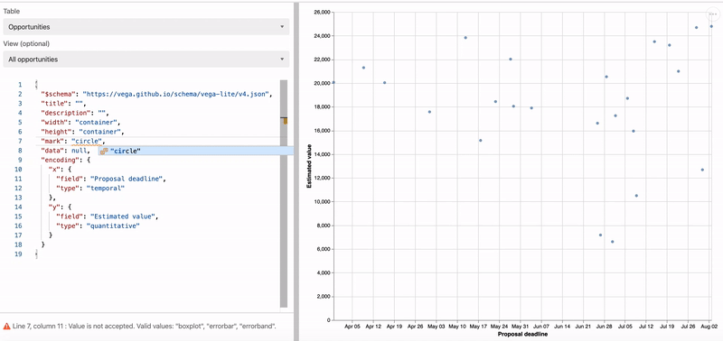

# Vega-Lite extension

[Vega-Lite](https://vega.github.io/vega-lite/) is a library for creating sophisticated charts,
visualizations, and interactive graphics.

The Vega-Lite extension brings the power of this library into your base.

## How to remix this extension

1. Create a new extension in your base (see
   [Create a new extension](https://airtable.com/developers/blocks/guides/hello-world-tutorial#create-a-new-app)),
   selecting "Remix from GitHub".

2. Paste https://github.com/Airtable/blocks-vega-lite for the GitHub repository

3. From the root directory of your new extension, run `block run`.

## See the extension running

