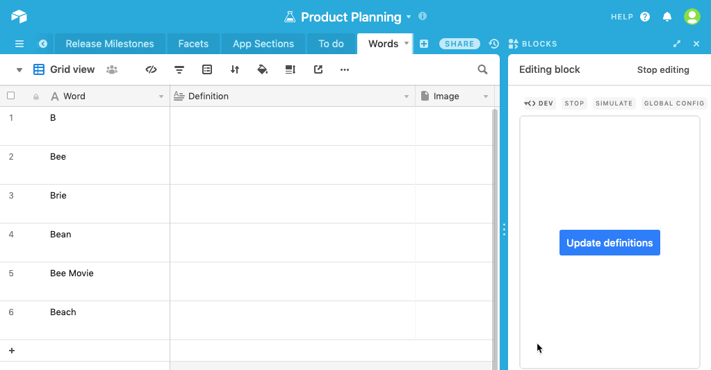

# Wikipedia Enrichment Block

This example block finds extracts and images from Wikipedia for records in your base and saves the
information back to your base.

The code shows:

-   How to connect to an outside API from your block
-   How to update records and upload attachments from your block
-   How to check permissions before updating records

## How to run this block

1. Copy [this base](https://airtable.com/shrIho8SB7RhrlUQL).

2. Create a new block in your new base (see the [setup guide](/packages/sdk/docs/setup.md)), pasting
   the template block token `@airtable/wikipedia-enrichment-block` into the `template` field.

3. From the root of your new block, run `block run`.

## Template block token

The token for using this code as a starting point for a new block. (See above for further
instructions on how to do this.)

```
@airtable/wikipedia-enrichment-block
```

## See the block running


